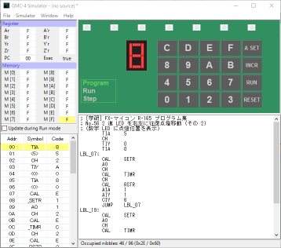

Gakken GMC-4 Simulator
======================

What's This?
------------
This is a program that simulates a board of 4-bit microprocessor named GMC-4
that has been provided by Gakken (http://otonanokagaku.net/magazine/vol24/index.html).
This also includes an assembler, disassembler and a simple
assembler editor so that you can develop a program for that processor.

Install
-------
パッケージ GMC4Sim-1.38.zip をダウンロードし、適当なディレクトリに展開してください。gmc4sim.exe が GUI 版の実行ファイルです。Sample ディレクトリの下に、学研のホームページで公開されている「FX マイコン R-165 プログラム集」のプログラム、全 93 リストを HEX 形式にしたファイルを格納しています。

Usage
-----
メニューから [File] - [Open] で HEX ファイルを開くと、シミュレータの内部メモリにプログラムが読み込まれ、アセンブラエディタに逆アセンブル結果が出力されます。[Simulator] - [Run Mode] を選択するとシミュレータが Run モードになりプログラムを実行します。[Simulator] - [Reset] でプログラムを中断して Program モードにします。Program モードの状態で右下のアセンブラエディタで編集をし、[Simulator] - [Build] を選択すると変更内容がオブジェクトコードに反映されます。実機にプログラムを打ち込むときは、[Window] - [Show Dump] でダンプを表示すると便利です。アセンブラコードの保存は [File] - [Save] です。

[File] - [Open] はアセンブラコードもオブジェクトコードも開くことができ、拡張子から適切な処理を行ってシミュレート可能な状態にします。一度指定したファイルを更新したときは [File] - [Reopen] で再読み込みができるので、スムースに実験ができます。

詳しくは ユーザマニュアル をご覧ください。
